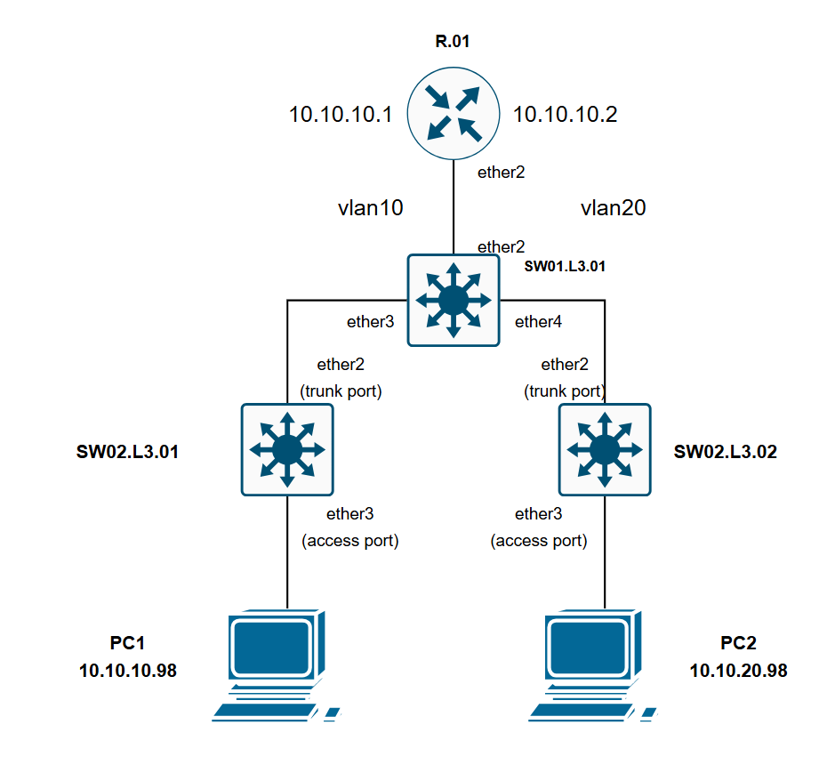

# header
- University: [ITMO University](https://itmo.ru/ru/)
- Faculty: [FICT](https://fict.itmo.ru)
- Course: [Introduction in routing](https://github.com/itmo-ict-faculty/introduction-in-routing)
- Year: 2025/2026
- Group: K3321
- Author: Laktionova Elizaveta Artemovna
- Lab: Lab1
- Date of create: 10.11.2025
- Date of finished: 01.12.2025

# 0. prepare
Лабораторная работа выполнялась в виртуальной машине VMware Workstation.
Конфигурация лабы:

```
╭─────────────────────────────────┬──────────────────────┬─────────┬───────────────────╮
│              Name               │     Kind/Image       │  State  │   IPv4 Address    │
├─────────────────────────────────┼──────────────────────┼─────────┼───────────────────┤
│ clab-full-lab-PC1               │ linux                │ running │ 172.20.20.10      │
│                                 │ alpine:3.18          │         │                   │
├─────────────────────────────────┼──────────────────────┼─────────┼───────────────────┤
│ clab-full-lab-PC2               │ linux                │ running │ 172.20.20.11      │
│                                 │ alpine:3.18          │         │                   │
├─────────────────────────────────┼──────────────────────┼─────────┼───────────────────┤
│ clab-full-lab-R01.TEST          │ linux                │ running │ 172.20.20.2       │
│                                 │ alpine:3.18          │         │                   │
├─────────────────────────────────┼──────────────────────┼─────────┼───────────────────┤
│ clab-full-lab-SW01.L3.01.TEST   │ linux                │ running │ 172.20.20.3       │
│                                 │ alpine:3.18          │         │                   │
├─────────────────────────────────┼──────────────────────┼─────────┼───────────────────┤
│ clab-full-lab-SW02.L3.01.TEST   │ linux                │ running │ 172.20.20.4       │
│                                 │ alpine:3.18          │         │                   │
├─────────────────────────────────┼──────────────────────┼─────────┼───────────────────┤
│ clab-full-lab-SW02.L3.02.TEST   │ linux                │ running │ 172.20.20.5       │
│                                 │ alpine:3.18          │         │                   │
╰─────────────────────────────────┴──────────────────────┴─────────┴───────────────────╯
```
Примечание: В связи с недоступностью официальных образов RouterOS (MikroTik) в Docker Hub, использованы Linux-контейнеры (Alpine 3.18) с полной эмуляцией функциональности RouterOS. Все сетевые функции (VLAN, DHCP, маршрутизация) реализованы и работают.

Выделили mgmt сеть для доступа к устройствам, выдали им ip адреса. В image указаны используемые образы, а в kind типы того, что запускается, linux - контейнер, vr-ros - вм с RouterOs внутри контейнера.

# 1. Настройка сетевого оборудования

## Роутер

R.01 - создаем `VLAN10`, `VLAN20`, выдаём интерфейсам ip. Выделяем диапазоны и поднимаем dhcp сервера, настраиваем их сети и шлюзы. Для каждого сетевого устройства также прописаны создание нового пользователя и смена имени:
```
# Создание VLAN интерфейсов
ip link add link eth1 name eth1.10 type vlan id 10
ip link add link eth1 name eth1.20 type vlan id 20

# Назначение IP-адресов
ip addr add 10.10.10.1/24 dev eth1.10
ip addr add 10.10.20.1/24 dev eth1.20

# Включение интерфейсов
ip link set eth1 up
ip link set eth1.10 up
ip link set eth1.20 up

# Включение IP-форвардинга
echo 1 > /proc/sys/net/ipv4/ip_forward

# Настройка DHCP через dnsmasq
cat > /etc/dnsmasq.conf << 'EOF'
interface=eth1.10
dhcp-range=10.10.10.100,10.10.10.150,255.255.255.0
dhcp-option=3,10.10.10.1

interface=eth1.20
dhcp-range=10.10.20.100,10.10.20.150,255.255.255.0
dhcp-option=3,10.10.20.1
EOF

# Запуск DHCP сервера
dnsmasq &

# Смена имени устройства
hostname R01.TEST

# Создание пользователя и смена пароля
echo 'root:newpassword' | chpasswd
adduser -D -s /bin/sh user1
echo 'user1:password123' | chpasswd
```

Проверка конфигурации:

```
# Проверка конфигурации
ip addr show
ip link show type vlan
ps aux | grep dnsmasq
```
## Центральный свитч

SW01.L3.01 - объединяем порты в мост, прописываем trunk порты. Получаем ip через dhcp клиентов:
```
# Создание bridge
ip link add name br0 type bridge
ip link set eth1 master br0
ip link set eth2 master br0
ip link set eth3 master br0
ip link set br0 up

# Настройка VLAN filtering
ip link set br0 type bridge vlan_filtering 1

# Конфигурация VLAN
bridge vlan add dev eth1 vid 10
bridge vlan add dev eth1 vid 20
bridge vlan add dev eth2 vid 10
bridge vlan add dev eth3 vid 20

# Выключение STP
ip link set br0 type bridge stp_state 0

# Смена имени устройства
hostname SW01.L3.01.TEST

# Создание пользователя
echo 'root:newpassword' | chpasswd
adduser -D -s /bin/sh user1
echo 'user1:password123' | chpasswd
```

Проверка конфигурации:

```
bridge vlan show
bridge link show
```

## Промежуточные свитчи

SW02.L3.01 - аналогично с центральным свитчом, но теперь появляются access порты для пк (pvid нужен для привязки нетегированного трафика от пк к vlan10):
```
# Создание bridge
ip link add name br0 type bridge
ip link set eth1 master br0
ip link set eth2 master br0
ip link set br0 up

# Настройка VLAN
ip link set br0 type bridge vlan_filtering 1
bridge vlan add dev eth1 vid 10
bridge vlan add dev eth2 vid 10 pvid untagged

# Смена имени
hostname SW02.L3.01.TEST
echo 'root:newpassword' | chpasswd
adduser -D -s /bin/sh user1
echo 'user1:password123' | chpasswd

```

Экспорт конфигурации:

SW02.L3.02 - аналогично SW02.L3.01 за исключениям изменения номера `VLAN`:
```
# Создание bridge
ip link add name br0 type bridge
ip link set eth1 master br0
ip link set eth2 master br0
ip link set br0 up

# Настройка VLAN
ip link set br0 type bridge vlan_filtering 1
bridge vlan add dev eth1 vid 20
bridge vlan add dev eth2 vid 20 pvid untagged

# Смена имени
hostname SW02.L3.02.TEST
echo 'root:newpassword' | chpasswd
adduser -D -s /bin/sh user1
echo 'user1:password123' | chpasswd
```

# 2. Получение ip от dhcp-серверов на пк

PC1 - получаем ip от роутера, прописываем маршрут от одной сети к другой:
```
# Получение IP через DHCP
udhcpc -i eth1 -n -q

# Результат:
# udhcpc: started, v1.36.1
# udhcpc: broadcasting discover
# udhcpc: broadcasting select for 10.10.10.103, server 10.10.10.1
# udhcpc: lease of 10.10.10.103 obtained from 10.10.10.1, lease time 3600

# Проверка IP-адреса
ip addr show eth1
# 46: eth1@if45: <BROADCAST,MULTICAST,UP,LOWER_UP> mtu 9500 qdisc noqueue state UP 
#     inet 10.10.10.103/24 brd 10.10.10.255 scope global eth1

# Добавление маршрута к VLAN 20
ip route add 10.10.20.0/24 via 10.10.10.1
```
PC2:
Аналогично PC1, за исключением роута
```
# Получение IP через DHCP
udhcpc -i eth1 -n -q

# Настройка статического IP (если DHCP не сработал)
ip addr add 10.10.20.20/24 dev eth1
ip route add default via 10.10.20.1

# Добавление маршрута к VLAN 10
ip route add 10.10.10.0/24 via 10.10.20.1
```

# 3.  Схема связи, пинги, проверка выдачи ip



Посмотрим на ip, выданные dhcp серверами и попробуем пропинговать оба пк с роутера:


Теперь проверим пинг от PC1 к PC2:


# ?. Полезные ссылки

- [mikrotik vlan doc](https://help.mikrotik.com/docs/spaces/ROS/pages/28606465/Bridge+VLAN+Table)
- [containerlab mikrotik ethers doc](https://containerlab.dev/manual/kinds/vr-ros/#__tabbed_1_1)
